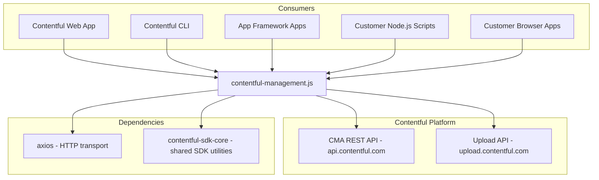

<!-- Generated by seed-golden-context | Last updated: 2026-05-07 -->

# Architecture

## Overview

`contentful-management` is the official JavaScript SDK for Contentful's Content Management API (CMA). It provides a typed, rate-limited HTTP client that wraps the CMA REST endpoints, enabling Node.js and browser applications to manage content types, entries, assets, spaces, environments, and all other CMA resources programmatically.

## System Context

## Internal Structure

| Directory | Purpose |
|---|---|
| `lib/` | Source root for the entire library |
| `lib/index.ts` | Package entry point; exports `createClient` and all public types |
| `lib/plain/` | Plain client implementation — the flat, data-first API surface (default since v12) |
| `lib/plain/plain-client.ts` | Factory for the plain client; creates entity-method namespaces |
| `lib/plain/plain-client-types.ts` | TypeScript interface for the full `PlainClientAPI` |
| `lib/plain/as-iterator.ts` | Async iterator utilities for paginated collections |
| `lib/plain/pagination-helper.ts` | `fetchAll` helper for exhaustive pagination |
| `lib/plain/checks.ts` | State helpers: `isDraft`, `isPublished`, `isUpdated` |
| `lib/entities/` | Entity type definitions (~83 files) — one per CMA resource type |
| `lib/adapters/REST/` | REST adapter layer — translates plain client calls into HTTP requests |
| `lib/adapters/REST/rest-adapter.ts` | Core adapter: request orchestration, auth, rate limiting |
| `lib/adapters/REST/endpoints/` | Per-entity endpoint implementations (~85 files) mapping methods to HTTP calls |
| `lib/adapters/REST/make-request.ts` | Low-level request builder |
| `lib/create-contentful-api.ts` | Legacy (nested) client factory — deprecated, will be removed in next major |
| `lib/create-*-api.ts` | Legacy entity-scoped API factories (Space, Environment, Entry, etc.) |
| `lib/common-types.ts` | Shared type definitions (Link, Sys, Collection, MakeRequest, etc.) |
| `lib/export-types.ts` | Re-exports all public types for the `contentful-management/types` entry |
| `lib/methods/` | Shared method implementations used by legacy client wrappers |
| `dist/` | Build output (not committed) — ESM, CJS, browser bundle, and type declarations |
| `test/unit/` | Unit tests (Vitest) |
| `test/integration/` | Integration tests against live CMA (Vitest) |
| `test/output-integration/` | Demo project tests verifying the built package works in Node and browser |

## Data Flow

1. **Consumer calls a plain client method** (e.g., `client.entry.get({ spaceId, environmentId, entryId })`)
2. **Plain client** routes the call to the corresponding **REST endpoint handler** in `lib/adapters/REST/endpoints/`
3. **REST adapter** constructs the HTTP request (URL, headers, body) via `make-request.ts`
4. **axios** executes the request against the CMA REST API with:
   - OAuth bearer token authentication
   - Built-in rate limiting with exponential backoff (429 retry)
   - Server error retry (500)
   - User-agent header identification
5. **Response** is returned as a plain JavaScript object (no wrapper classes in the plain client)

For the **legacy client**, an additional step wraps the response in entity objects with bound methods (e.g., `entry.update()`, `entry.publish()`).

## Key Dependencies

| Dependency | Why it's here |
|---|---|
| `axios` | HTTP client for Node.js and browser environments; provides interceptors, proxy support, and request/response transformation |
| `contentful-sdk-core` | Shared Contentful SDK utilities — user agent generation, error handling, rate limiting logic |
| `@contentful/rich-text-types` | Type definitions for Rich Text fields (used in entry type definitions) |
| `fast-copy` | Deep cloning for the legacy client's entity instances |

## Configuration

The library is configured via the `createClient()` options object:

| Option | Purpose | Default |
|---|---|---|
| `accessToken` | CMA OAuth bearer token (required unless `apiAdapter` is provided) | - |
| `host` | CMA API hostname | `api.contentful.com` |
| `hostUpload` | Upload API hostname | `upload.contentful.com` |
| `basePath` | Path prefix for custom gateway/proxy setups | `""` |
| `retryOnError` | Enable automatic retry on 429/500 | `true` |
| `throttle` | Rate limit: number (1-30), `'auto'`, or percentage string | `0` (disabled) |
| `httpAgent` / `httpsAgent` | Custom Node.js HTTP agents | `undefined` |
| `headers` | Additional request headers | `{}` |
| `proxy` | Axios proxy configuration | `undefined` |
| `logHandler` | Custom log handler for errors/warnings | console logger |
| `apiAdapter` | Custom adapter (replaces default RestAdapter) | `RestAdapter` |

## Integration Points

### Upstream (this library wraps)

- **Contentful CMA REST API** (`api.contentful.com`) — full Content Management API surface
- **Contentful Upload API** (`upload.contentful.com`) — binary asset upload

### Downstream (consumes this library)

- **Contentful Web App** — uses this SDK for all CMA operations
- **Contentful CLI** (`contentful-cli`) — import/export and space management commands
- **Contentful App Framework** (`@contentful/app-sdk`) — apps use this via the CMA adapter
- **Customer applications** — any Node.js or browser app managing Contentful content programmatically
- **Contentful Migration CLI** (`contentful-migration`) — content model migrations
